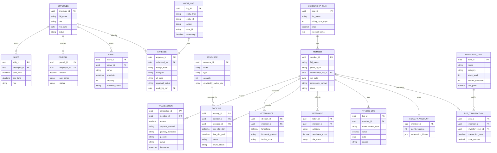

```mermaid
erDiagram
    MEMBERSHIP_PLAN {
        uuid plan_id PK
        string tier_name
        int billing_cycle_days
        decimal price
        text renewal_terms
    }

    MEMBER {
        uuid member_id PK
        string full_name
        string photo_id_url
        uuid membership_tier_id FK
        date join_date
        string emergency_contact
        string status
    }

    TRANSACTION {
        uuid transaction_id PK
        uuid member_id FK
        decimal amount
        string payment_method
        string gateway_reference
        string gl_code
        string status
        datetime timestamp
    }

    ATTENDANCE {
        uuid checkin_id PK
        uuid member_id FK
        datetime timestamp
        string biometric_method
        string facility_zone
    }

    EMPLOYEE {
        uuid employee_id PK
        string full_name
        string role
        date hire_date
        string status
    }

    SHIFT {
        uuid shift_id PK
        uuid employee_id FK
        datetime start_time
        datetime end_time
        string role
    }

    PAYROLL {
        uuid payroll_id PK
        uuid employee_id FK
        decimal amount
        string pay_period
        string status
    }

    EXPENSE {
        uuid expense_id PK
        uuid submitted_by FK
        string receipt_hash
        string category
        string gl_code
        string approval_status
        uuid audit_log_ref FK
    }

    RESOURCE {
        uuid resource_id PK
        string name
        string type
        int capacity
        string availability_cache_key
    }

    BOOKING {
        uuid booking_id PK
        uuid member_id FK
        uuid resource_id FK
        datetime time_slot_start
        datetime time_slot_end
        string status
        string refund_status
    }

    EVENT {
        uuid event_id PK
        uuid trainer_id FK
        string name
        datetime schedule
        int capacity
        string reminder_status
    }

    FEEDBACK {
        uuid ticket_id PK
        uuid member_id FK
        string category
        decimal sentiment_score
        string sla_status
    }

    FITNESS_LOG {
        uuid log_id PK
        uuid member_id FK
        string measurement_type
        decimal value
        date date
        string source
    }

    LOYALTY_ACCOUNT {
        uuid member_id PK
        int points_balance
        json redemption_history
    }

    INVENTORY_ITEM {
        uuid item_id PK
        string name
        string category
        int stock_level
        int reorder_threshold
        decimal unit_price
    }

    POS_TRANSACTION {
        uuid pos_id PK
        uuid member_id FK
        uuid inventory_item_id FK
        datetime transaction_date
        decimal total_amount
    }

    AUDIT_LOG {
        uuid log_id PK
        string entity_type
        string entity_id
        string action
        string user_id
        datetime timestamp
    }

    MEMBERSHIP_PLAN ||--o{ MEMBER : "has"
    MEMBER ||--o{ TRANSACTION : "makes"
    MEMBER ||--o{ ATTENDANCE : "checks in"
    MEMBER ||--o{ BOOKING : "creates"
    MEMBER ||--o{ FEEDBACK : "submits"
    MEMBER ||--o{ FITNESS_LOG : "logs"
    MEMBER ||--|| LOYALTY_ACCOUNT : "owns"
    MEMBER ||--o{ POS_TRANSACTION : "purchases"

    EMPLOYEE ||--o{ SHIFT : "works"
    EMPLOYEE ||--o{ PAYROLL : "receives"
    EMPLOYEE ||--o{ EVENT : "trains"
    EMPLOYEE ||--o{ EXPENSE : "submits"

    RESOURCE ||--o{ BOOKING : "reserved via"
    INVENTORY_ITEM ||--o{ POS_TRANSACTION : "sold in"
    AUDIT_LOG ||--o| EXPENSE : "logs"
```
